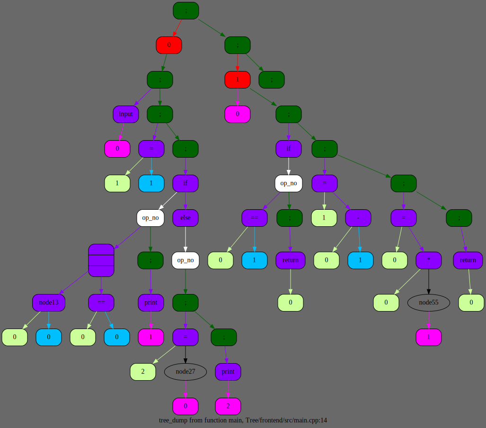

# Язык программирования

## Введение

Данный проект является представлением моего языка программирования, писать который я начал в декабре 2023 года. В мае 2024 года я продолжил работу над ним.

Проект состоит из 4 частей:
1. Frontend
2. Middleend
3. Backend
4. Reverse frontend

Более подробно про каждый из них, поговорим чуть позже.

> [!NOTE]
>
> Язык поддерживает только целочисленные типы данных, поэтому нет типа данных.

## Скачивание и установка проекта

Для установки программы используются утилиты `make` и `git`.

```CMake
    git clone git@github.com:EntryFrager/language.git
    cd language
    make
```

## Принцип работы компилятора

Работа компилятора состоит из нескольких этапов:
1. Лексический анализ кода (разбиение на токены) и синтаксический анализ кода (создание абстрактного синтаксического дерева) (данная часть выполняется на этапе frontend)
2. Оптимизации дерева (middleend)
3. Трансляция дерева в ассемблерный код (backend)

> [!NOTE]
>
> Ниже приведен пример `AST`.



Рассмотрим более подробно backend. В моем проекте возможны трансляции в два вида ассемблерных кода:
1. NASM (x86-64)
2. Мой собственный ассемблер

Для моего ассемблера я взял старый проект SPU. Он состоит из двух частей:
1. Ассемблер (на основе ассемблерного кода создает бинарный код для процессора)
2. Процессор (представляет из себя виртуальную машину, которая выполняет бинарны код)

Я использовал два вида ассемблера, чтобы измерить время выполнения итоговой программы для обоих вариантов итоговых программ и сравнить их. Но перед этим поговорим ещё немного про язык.

## Отличие NASM от моего ассемблера

Главным отличием является то, что для перемещения данных в моем ассемблере используется стек. Поэтому все инструкции берут свои аргументы из стека. Также мой ассемблер составляет ассемблерный листинг, который сохраняется в папке `files`.

Также в моем ассемблере присутствуют инструкции `in` и `out`, которые соответственно читают и выводят значения, использую стандартные потоки ввода и вывода (`stdin`, `stdout`). В `NASM` для данных функций я написал свою библиотеку `stdio.asm`.

## Примеры программ на языке

Я написал два примера для тестирования языка:
1. Программа, решающая квадратное уравнение
2. Программа, считающая факториал от n

Приведу код второго примера. С первым примером вы можете ознакомиться самостоятельно.

```C
def main()
{
    input(a);

    NO_FACT = 1;

    if (a < 0 || a == 0)
    {
        print(NO_FACT);
    }
    else
    {
        result = fact(a);

        print(result);
    }
}

def fact(n)
{
    if (n == 1)
    {
        return n;
    }

    b = n - 1;

    n = n * fact(b);

    return n;
}
```

## Сравнение времени выполнения
